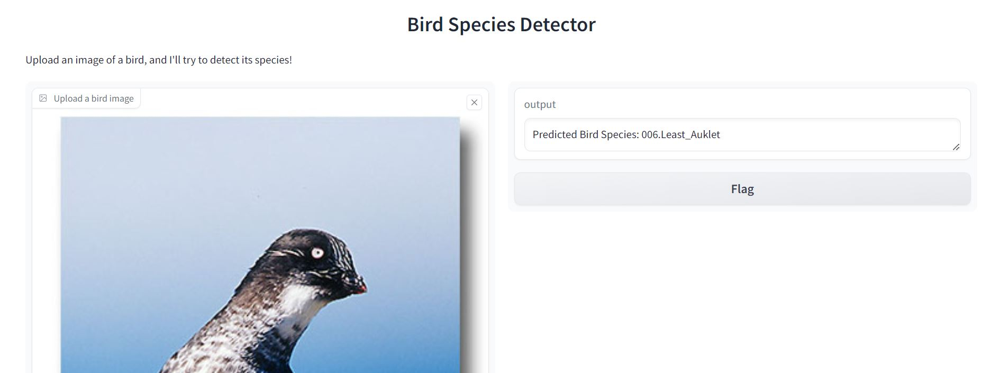

# Finetune_ViT
Bird Species Detector

This project is a Bird Species Detector that has ued ViT which has been fine tuned on the CUB_200_2011 dataset on bird species. The project provides an intuitive Gradio interface where users can upload images and receive predictions on the bird species.

Fine-tuning a model on bird species contributes to the conservation of biodiversity, helps in monitoring ecological changes, and aids scientific research by providing accurate, scalable tools for species identification, thereby supporting global efforts to protect wildlife and ecosystems.

 
